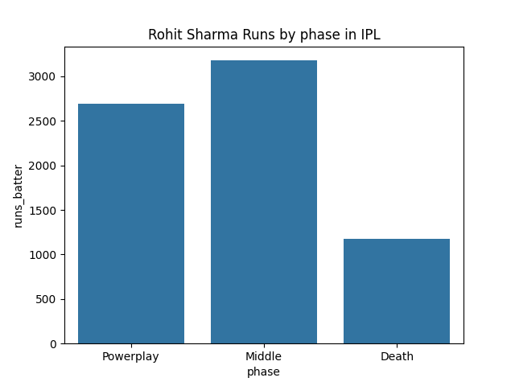
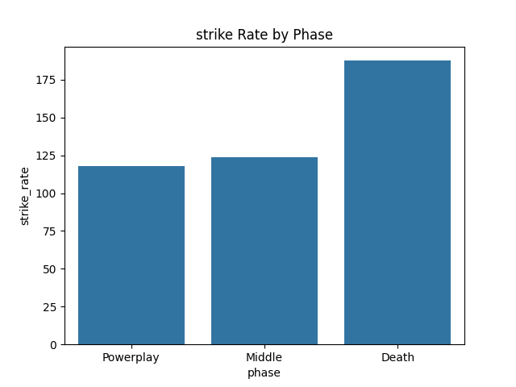
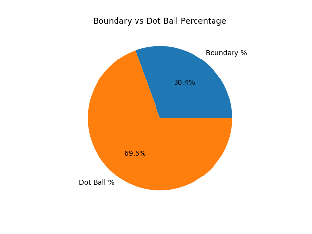
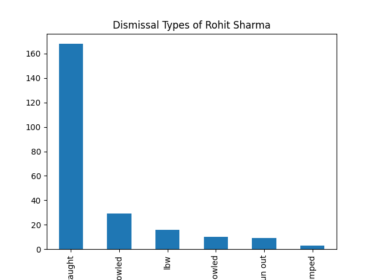
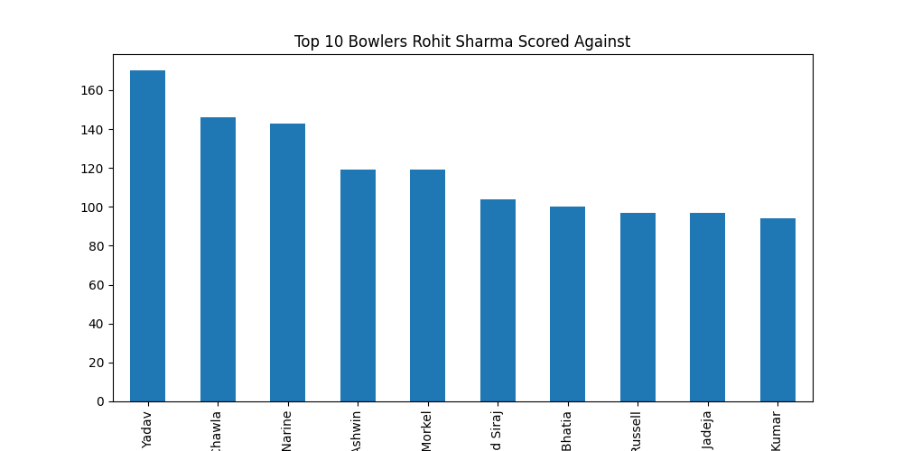
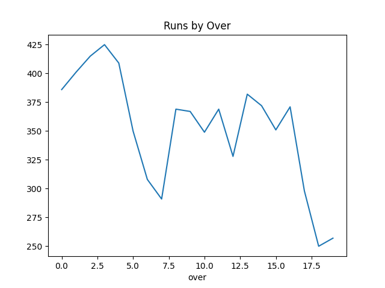
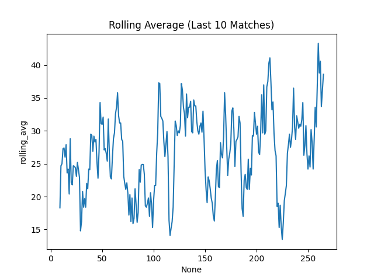

# IPL Batting Analysis – Rohit Sharma

## Objective

This project analyzes the IPL batting performance of Rohit Sharma using ball-by-ball data.  
The goal is to move beyond basic statistics and understand *how*, *when* and *against* he scores runs, along with identifying patterns in his gameplay.

## Dataset

The dataset is sourced from Cricsheet, which provides ball-by-ball match data for the Indian Premier League (IPL).

It includes:
- Every delivery in a match
- Runs scored
- Wickets
- Batters and bowlers involved
- Match context

- Format: JSON (converted to structured DataFrame using Python)
- Scope: Multiple IPL seasons
- Note: Raw data files are excluded from this repository for size and cleanliness

## Tools & Technologies

- Python (pandas, matplotlib, seaborn)
- Jupyter Notebook
- VS Code
- Git & GitHub

## Key Areas of Analysis

The analysis focuses on:

- Performance across match phases (Powerplay, Middle, Death)
- Strike rate variation
- Boundary vs dot ball percentage
- Runs scored against different teams
- Dismissal patterns
- Consistency across matches

## Key Insights

- Rohit Sharma scores a large portion of his runs in the Middle Overs, indicating a role that beyond aggresive starts into building innings stability. 

- His strike rate drops during the Middle overs, and Death Overs suggesting a phase of consolidation where scoring slows down compared to other phases.

- A high boundary percentage highlights his ability to score quickly, but a noticeable number of dot balls indicates periods where momentum can stall.

- Performance varies against different teams, suggesting that certain bowling attacks are more effective in restricting him.

- Most dismissals occur via catches, reflecting an attacking approach that involves aerial shots and risk-taking.

- Match-wise analysis shows inconsistency, with a mix of low scores and high-impact innings, indicating a high-risk, high-reward profile.

## Visualizations

The project includes multiple charts such as:

-   
-   
-    
-   
-   
-   
-   

All visualizations are available in the `charts/` directory.

##  Conclusion

Rohit Sharma fits the profile of a top-order batter who plays an aggressive role in the Powerplay and has the ability to shift momentum quickly. However, his scoring rate in the Middle overs and overall consistency present areas where opposition teams can apply pressure.

## What This Project Shows
This project is not just about generating charts, it focuses on:

- Understanding cricket context
- Applying data analysis to real match situations
- Extracting meaningful insights from raw data

## Future Improvements

- Add bowler-type analysis (pace vs spin)
- Include venue-based performance
- Build a match situation impact model
- Extend analysis to compare with other top-order batters

